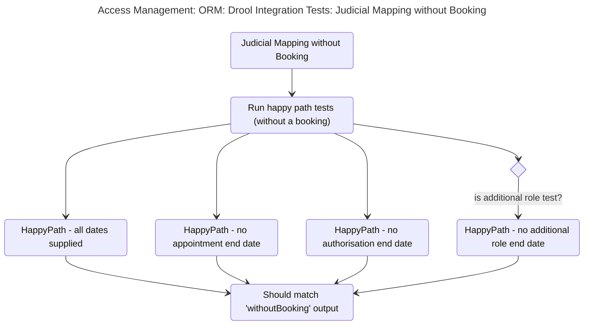
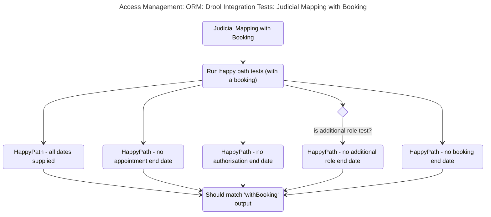

# Integration Test for Drool mappings

## Test Scenarios in: BaseJudicialDroolTestIntegration

### .assertCreateOrmMappingApiWithoutBooking

* ([mermaid live edit](https://mermaid.live/edit#pako:eNqdlFFr2zAQx7_KoZduED8syZMoGRsZbIPQ0Q4GwxA06WKLyZKR5IZQ-t13khOnSZOmnR-M5fv_f7buTvfApFPIOCuKorRRR4McSvZJSgwBFsKKChu0kcPN7YLD3Dtn4JuNWHkRtbPwE0MMHL53SkstDFnaVtsK1jrWrovw2bm_tC5ZafMnQhQR51qQvynux6UtLdC1tWUacM4h0hO8grv133b2Kyk2P0Ss9wB6S4x0r1MQWormQIB3O5CAPz3q_Y41gD5kUJBohdeOSEMEChDGgKK9BAhd2xqNCo7s45fs1gGtnLYxpRfQqkw7QkwuITrahNehr8UZyPQSRCmd_JRl7ww-wfSgQHkyaiGirH_1Sdsm_6aLLWUw0T2GzqSC3WUxNEkNV-sD_RW47BjAqRdAh-X-D5bpD5a5-NfXsnZa4mx2skmKYnZY9dOtkGT7gl5UjC8qJucUZ_bRy89t8gA95aR7Vo6k-3iiN5P1QmmeNeTbPZP_8Exf5-ld0ogQ5rgaDuxKG8OdF7bCE4o-vK51PI5uWzDHK49oR9IZ509qh8OQ1Vbcb56K2Yg16BuhFQ3Gh2QtWaxpDpYsDUeFK0FfSiPtkaR0Bt3dxkrGo-9wxLzrqprxlTCBVl2r9gNveNsK-9u55kj1hQrv_I6DebXox3Oe0o__ACna-sg))

### .assertCreateOrmMappingApiWithBooking

* ([mermaid live edit](https://mermaid.live/edit#pako:eNqVlV1r2zAUhv_KQTfdIL5YPm5EydjIYBuEjnYwGIagSSe2mCwZfTSE0v8-SXadNk3qxRfB8nnfJ_p4ffxAuBFIKCmKotReeoUUSvKJc3QO1kyzChvUnsLN7ZrCyhqj4Jv2WFnmpdHwE513FL4HIblkKlraVuoKdtLX8NmYv3FQklJnvvPM40qyaG6K-2mpSw3x6j0ZBZRS8PEOxqC9-Tbor7G8_8F8fXDHpxGQfutUhDZWc8HBu0xh8KfjvH8CDZQPmeI4amaliZihAgUwpUDEVThwoW2VRAFH9ulbdm0gjozUPu0qoBaZdoSYjSGCr42VrjuCM5D5GEQImfxxf61ReA6zGMH02_jM3gFcbYISa-Z5_StueH9qN8G3wWekRRdUOua7rIQmSeFqdxBfgcnyAZniA9JtDlPfpKlvcl6ur3ltJMfl8mSuimL5MiunA5RkhySMKqajitk5xZl1dPJzi3yBntOoe3WOSfdxdFqLE7FPgreO7VXQLzTMLjXMLzUs_sPQWbhizq1wO3SLrVSKGst0hScUXXlXS39c7WOc65VF1BNulLEntcNblNWa3e-fi8mENGgbJkXsxw_JWhJfx_ZbktSTBW5Z_KfUTB-jNPYAc7fXnFBvA06INaGqCd0y5eIotOLQaoenLdO_jWmOVF9ifox94mAerbuvQv44PP4Dz8sf9Q))

### .assertCreateOrmMappingApiWithExpiredDates

* ([mermaid live edit](https://mermaid.live/edit#pako:eNqdVU2PmzAQ_SsjLttK4dAkJ7RKtVVy6ErZrpK9tEKKXBjAqvFQ22Qbrfa_dwwLSRPSRMsBgee9N54Pj1-ChFIMoiAMw1g76RRGEAd3SYLWwlJokWOJ2kXwbbWMYG6IFHzVDnMjnCQNT2idjeC-TmUihWJKVUmdwwPmDNhiC4iDWDcerBMO51IwvQy341jHGvh5YzVYiKIIHH_BZdk3-qrWneFRuGIvwQZW8W_dESsGNDYLH54lfwv4SfSLxT92cp2W9_Gp0bIJamEksdihEULgfZHUzucIUKeQcnyAfyppMD1VG19Sq11BRto2t5f1Jpf00lR6Kc6gIYVXKE4vKFrKHKSokEUyJXKw6Lq8aeJFI_PCAWUDRYEH6hx3OW8LbfB33awKC_df1kBa7XjR1UZb2Aole3xfcltQrdKlcEmxKCu3W3F4d9bKXPtStB1g0NbKt9G6AUPp0XCzWD4-fQdPgAPGDVDtqroPpulUkHazz-HG53DT7Pj2NilIJjibDbZwGM5O4j_brB78T8tdiRv_B3dm3y3jXFDHDiYRQ096yEM_X7nF6fCR8rALBRw6O--iTd5Hm15Ha4mJEtbOMetnTiaVisgIneMAojU_F9IdW986trHnBlGPElJkBrH9GW3QWmx3h-BgFJRoSiFTHu4vnhoHruBZHgd-wKeYCfbk5_IrQ3nu0HqnkyBypsZRYKjOiyDKhLL8V1fpfmr3q5XQP4jKI9SCm4VMp4PN37K9Ypqb5vUvUs5D3w))