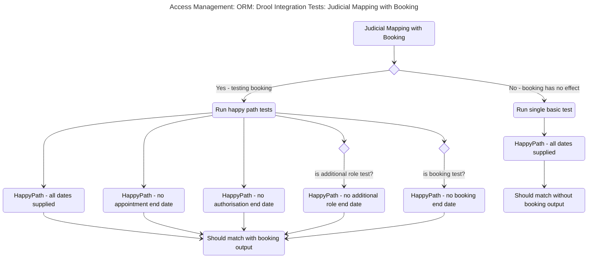
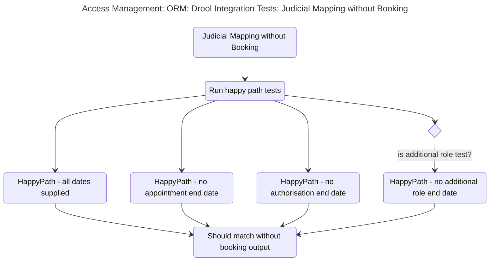
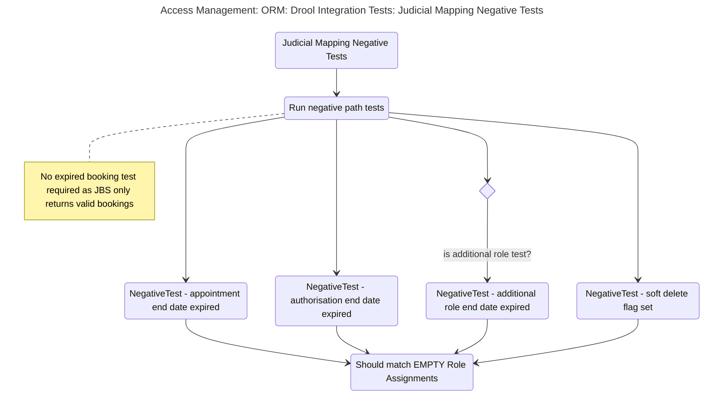

# Integration Test for Drool mappings

## Test Sceanrios in: BaseJudicialDroolTestIntegration

### .assertCreateOrmMappingApiWithBooking

* ([mermaid live edit](https://mermaid.live/edit#pako:eNqVlm9r2zAQxr_K4dfxi6bJG1EyVjLYBllHWxgbhqDKciymSEZ_WkLpd99Jjp04tpMlL0Ls-z3PObo7ye8J0zlPSJKmaaaccJITyJLPjHFrYUUV3fAtV47Aw-OKwNJoLeGbcnxjqBNawTO3zhL47nPBBJUoqSqhNvAmXAn3Wv_FiyzJVPS3jjq-FBTF2_R1mqlMAX72mmgFhBBw-Asume7Fj159xfDuJ3XlQY130SB8lyEIFUZjwLaqe2oFe46ZeiKLCSSHl4DEUJOtTXUTVZZxRY3QKGsjkAKVEnL8qxasryopeA4n8uk5udKAV1ooF5YeuMqj24nF7SUL70pthK3rNGIyu2SS5yLosQhG44qM2Mwv2LzUNTuSnxjEYly9pLWJLbWX-Yo6Vv7CBtn3x4N3la9ra7j1MjTUUyRhG9C6mZoH05Ee9MPQNZaI91z3vqH7wYfeWjfE3R0rtWB8sThmhG2AdRyFUepQnnUoT58eGLA0XXQfoqG6TxawzmwR-I2rn8ZxCECrHtW2E0bgh0ZlEy6pDU3Bi4IzdzTHh4kMBt3eGB73DndzkZheJG7HiJHFrvGxSnSsZwS53kAF7tOZpMd90CbrNEcnyTwmaRZ6b97buoLk3NT0NqsrBbfXCmbXCub_IRjcYgZkpwPeKJmk1i550Z4NhZCSaEPVhg8QdfitFO40ut8sYnxjOFcTpqU2g2y7_UVa0dfdMZxMki03WypyPLLfgzRLXIkndJaEYzvnBcVM4bz9QBRPAP20Uywhzng-SYz2mzIhBZUWr3yVH07j9m5F1R-ttyfUF2xabRofHq9W9YtDfH_4-AfXE9_g))

### .assertCreateOrmMappingApiWithoutBooking

* ([mermaid live edit](https://mermaid.live/edit#pako:eNqdVO9r2zAQ_VcOfY4_LMknUTI2MtgGoaMdDIYhaNLFFpMlox8tofR_30lOnTZ1lm7-YHy-956ke6d7YNIpZJxVVVXbqKNBDjX7ICWGABthRYMd2sjh-mbDYe2dM_DFRmy8iNpZ-I4hBg5fk9JSC0OUvte2gXsdW5cifHTuN8U1q21ZIkQRca0F8bvqbl7b2gI9B1pRA845RPqCN-ge-DfJfibE_puI7VGA_pJGfrc5CT1lSyI88UbSu0IKEq3w2hFrzEAFwhhQtO8AIfW90ajghD7_G906oMhpG3MpAa0qaicSi0sSiU7udRjqfkZkeUlEKZ35VFHvDD6TGYQCFdeojYiy_TFU-lDo6xR7KntW9xiSyebcFjB0GT0a82vAgyuEUTfbDjpsjxvY5g1si89XV7J1WuJqNdkPVbV6afC06xl29PMiYn4RsTiHOHOOAX7ukC-kl5xwr9zIuPcTrZmpF5x51Y__zln8B2f5Ns7AkkaEsMbdeDd32hjuvLANTiCG9H2r42n20IEl33hEO5POOD-JHe9CQVtxt38OZjPWoe-EVjQDHzK1ZrGlkVezPAcV7gStlKfXI0HpCrrbvZWMR59wxrxLTcv4TphAUerVcbaNf3thfzrXnaA-kfHOP-lgiTbDJC4D-fEPdGnzqw))

### .assertCreateOrmMappingApiWithExpiredDates

* ([mermaid live edit](https://mermaid.live/edit#pako:eNqdlU2P2jAQhv_KyGdyKMspWlFtBYeuxHYFe2kVCbnJJLHqeFLboUWr_e-1HRJYCA1aDhHxPO_rjxlPXllKGbKYRVGUKCusxBgS9pCmaAysuOIFVqhsDN_WqxgWmkjCV2Wx0NwKUvCCxpoYHptMpIJLJ6lroQp4wsIBO2yBhCUqzGAst7gQ3MmraDdNVKLA_Q6qwEIcx2DdPxi3PcjXjeoCz9yWRwsXcC7-qTph7YAQ69Wd1Ft-ClKTouJakNOeBiECtwwSyvojAVQZZG47gH9roTG7dJuOuTW2JC1Me5TjfndjflkmvJU7ME0Sb3CcjTgayi1kKNGZ5JIXYNB256bIDWpRlBYoH8gBPFE3Mfwk-uXzF_Kq8XcTRrmBxy8bICX3btA2WhnYcSl6vs-RKamR2YrbtFxWtd2v3fYejBGF8qloE67RNNJXzSbAUHkalqvnl-_geTgR9L6-HkGY7fHotv7otmGh9_dpSSLF-XywUKNofrHtqyXp4XeVdiM3_Q93Zd2t4tqmzie4ix16UToe_XzjEmfDN8ljI3kbujIfkt19TDa7TdYKU8mNWWDed5ZcSBmT5qrAAaIN_ymFPY8eCjXEC42oJilJ0oNsfzUDrfhufwqzCatQV1xkroW_emnCbOk6dsJ8G88w524m333fHOraDW32KmWx1Q1OmKamKFmcc2ncW1Nnx97cj9Zc_SCqzqilKxbSnQ-Gt1X7IQnfk7d_koQ7CQ))