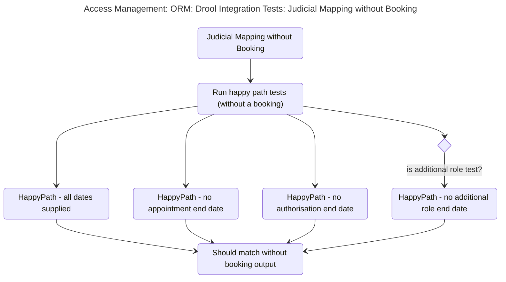
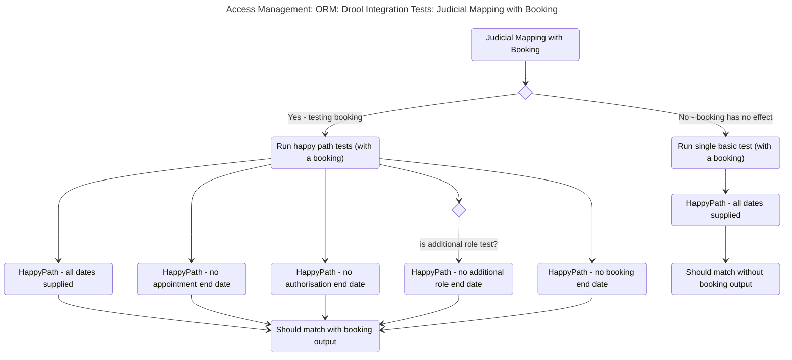
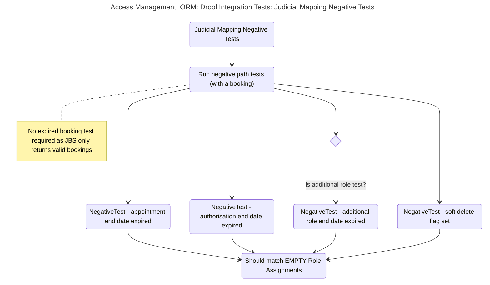

# Integration Test for Drool mappings

## Test Sceanrios in: BaseJudicialDroolTestIntegration

### .assertCreateOrmMappingApiWithoutBooking

* ([mermaid live edit](https://mermaid.live/edit#pako:eNqdlFFr2zAQx7_KoacN4ocleRIlYyODbRA62sFgGIImXWwxWTKS3BJKv_tOcuK0qTN384OxfP__z9bd6R6YdAoZZ0VRlDbqaJBDyT5IiSHARlhRYYM2cri-2XBYe-cMfLERKy-idha-Y4iBw9dOaamFIUvbalvBvY616yJ8dO43rUtW2vyJEEXEtRbkb4q7eWlLC3QdbJkGnHOI9ASv4B78N539TIr9NxHrE4DeEiPd6xSElqI5EODNESTgV496e2QNoHcZFCRa4bUj0hCBAoQxoGgvAULXtkajgjP7_G9264BWTtuY0gtoVaadIRZTiI424XXoa3EBspyCKKWTn7LsncEnmB4UKE9GbUSU9Y8-aYfkX3expQwmusfQmVSw2yyGJqmHYh0yDC4bBm5qBdBhe_qBbfqBba791ZWsnZa4Wo32SFGsnhd9vBOS7FTPScV8UrG4pLiwj15-aZPP0EtOuhfVSLr3I62ZrBOVedGP_-5Z_Idn-TpP75JGhLDG3XBed9oY7rywFY4o-vB9reN59NCBOV55RDuTzjg_qh3OQlZbcbd_KmYz1qBvhFY0Fx-StWSxpjFYsjQbFe4EfSlNtEeS0hF0t3srGY--wxnzrqtqxnfCBFp1rTrNu-FtK-xP55oz1ScqvPNHDubVpp_OeUg__gEom_q6))

### .assertCreateOrmMappingApiWithBooking

* ([mermaid live edit](https://mermaid.live/edit#pako:eNqVll1r2zAUhv_KwVcbxBfNx40oHSsZbIOsoy2MDUNQZdkWkyUjyS2h9L_vSE6c2LHrJRch8nnfx-J8SHmNmE55RKI4jhPlhJOcQBJ9ZoxbCxuqaM5LrhyBu_sNgbXRWsI35XhuqBNawSO3zhL4XqeCCSrRUlVC5fAiXAG3Wv_FRRIlKvCto46vBUVzGT_PE5UowM_eE1BACAGHv2AKujff1-orhnc_qSuObnyKAP9d-CBUGA0BCx8ChcJTw_nYYm6pFewxvPqMYlEpOTx5SbO9c0wDajdzFTCWcUWN0MhpIxADlRJSTIYFW1eVFDyFnn3-nl1pwJUWyvniAFdpoPUQiylE7QpthG0qOQJZTkHSVHg_lsloTNEIZjWB2afxxN4DhOpcnNIGYgtdy3RDHSt-YdX2HXRXu6puim24raVvuYeghNJLm3Y7bEwH9SAPQ5cgUX5G3XP9fEDtm217UFxfs0ILxm9uTjXCbo-J3_rEb0NXnqoHhiuOb7r4g6r7Ti_rzBWB35jXOHS-F7TuUW87TAR-aHQewgW1vtw8yzhzJzN8HD4P6FZ9eNQ7uqtJxXxSsRhTjCS7kY9VooNeEtSdjYrXfZrc1mrgZPGC95r67Cy50LC41LC81LD6D8PgCTBg68_fwckktXbNs_Ysz4SURBuqcj6gaMIvhXD96H6WQzw3nKsZ01KbQW17OgW1os-7U3E0i0puSipSvHNfvTWJXIFXbBL5ezflGcU3-QvzDaV4QOuHnWIRcabms8joOi8iklFpcVVX6fE6bZ9WVP3RuuypvmDnaXPg8LDaNDd_-APw9g8yBMj7))

### .assertCreateOrmMappingApiWithExpiredDates

* ([mermaid live edit](https://mermaid.live/edit#pako:eNqdlcGO2jAQhl9llFMrkUOBU7Si2goOXYntCvbSKhJyk0li1fGktsMWrfbdO05IoBAKWg4o8Xz_b3s8nrwGCaUYREEYhrF20imMIA7ukwSthaXQIscStYvg22oZwdwQKfiqHeZGOEkantE6G8FDncpECsWSqpI6h0fMGdhiC8RBrJsZrBMO51KwvAy341jHGvi3VzUsRFEEjp_guu1evqp1F3gSrjhYcIBd_L_uhBUDTczChxfJzwJ-Ev1i84-dXefl5_jUeNkEtTCS2Ow4CCHwukhq53MEqFNIeX-AfyppMD13G19zq11BRto2t9f9Jtf80lR6K86gIYU3OE6vOFrKHKSokE0yJXKw6Lq8aeJBI_PCAWUDhwKP1E3c5bw9aIO_62ZUWHj4sgbSaseDrjbawlYo2fP9kduCapUuhUuKRVm53Yq3d2-tzLU_irYCDNpa-TJaNzCUnobF8un5O3gejgS9ry9QkHZzSN3Gp27TLPTuLilIJjibDVZuGM7Otn2xRj38T6XdyI3_w11Yd6u4tKnTCSYRo2el49HPNy5xOnyTPHbl3IauzLtkk_fJprfJWmGihLVzzPpWk0mlIjJC5zhAtOGXQrrT6L5Qm3huEPUoIUVmkO2vZkNrsd0dw8EoKNGUQqbc01-9NA5cwS08DnxfTzETPJNvx2-Mcruh9U4nQeRMjaPAUJ0XQZQJZfmtrtJDs-5HK6F_EJUn1IKLhUzng83bsv2yNB-Yt781GUDA))